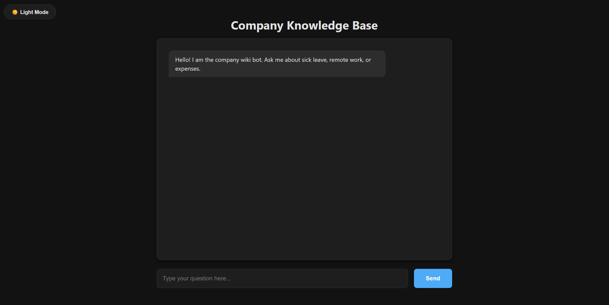
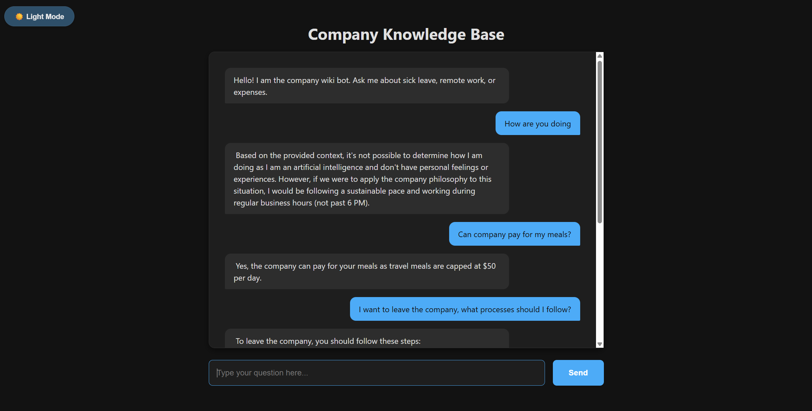

# Company Wiki Chatbot with Local RAG

A full-stack Retrieval-Augmented Generation (RAG) application that enables employees to query internal company documents using a secure, local AI pipeline. It utilizes vector search to ground answers in factual data, preventing hallucinations.




## 🚀 Features

* **Local Privacy:** Runs entirely offline using **Ollama** and local embeddings; no data leaves the machine.
* **Vector Search:** Uses **ChromaDB** and **HuggingFace** embeddings to perform semantic search over company handbooks.
* **Intelligent Retrieval:** Implements a custom LangChain pipeline to fetch relevant context before answering.
* **Modern UI:** A clean, responsive chat interface with Dark Mode support and real-time status indicators.

## 🛠️ Tech Stack

* **Frontend:** Vanilla JavaScript (ES6), HTML5, CSS3 (Flexbox/Grid).
* **Backend:** FastAPI (Python), Uvicorn.
* **AI Orchestration:** LangChain (Core + Community).
* **Vector Database:** ChromaDB (Local Persistence).
* **Inference Engine:** Ollama (running Mistral).

## 📋 Prerequisites

* **Python:** 3.12.9
* **Ollama:** Must be installed as a system service.
* **Hardware:**
  * **GPU:** Highly recommended (NVIDIA RTX series) for fast embedding and generation.
  * **RAM:** 8GB minimum (16GB recommended).

## ⚙️ Installation

1. **Clone the repository**
   ```bash
   git clone [https://github.com/Stywestern/company-wiki-bot.git](https://github.com/Stywestern/company-wiki-bot.git)
   cd company-wiki-bot

2. **Install Ollama**
    [https://ollama.com/download](https://ollama.com/download)

## ⚙️ Using Locally

1. **Create Embeddings**
    Assuming you have data stored in root/data, you can run ingestion.py
    ```bash
   python src/ingestion.py

   Successful completion will result in root/vector_db to populate with computed vectors.

2. **Make Inference**
    One may use rag.py to double check if the model can indeed change its responses in accordance with the data.
    ```bash
   python src/rag.py

3. **Mount the Web Server**
    ```bash
    uvicorn main:app --reload --log-level debug

    Follow the link in the terminal to work with the app in a browser.
