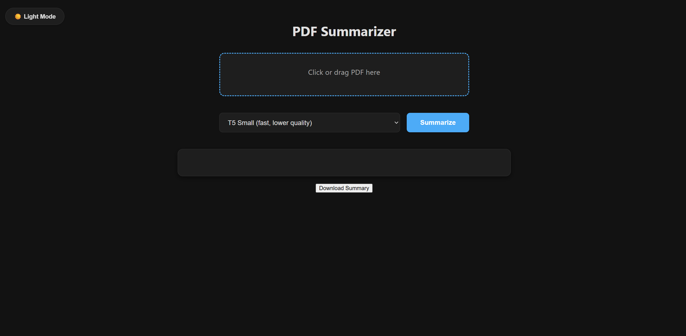
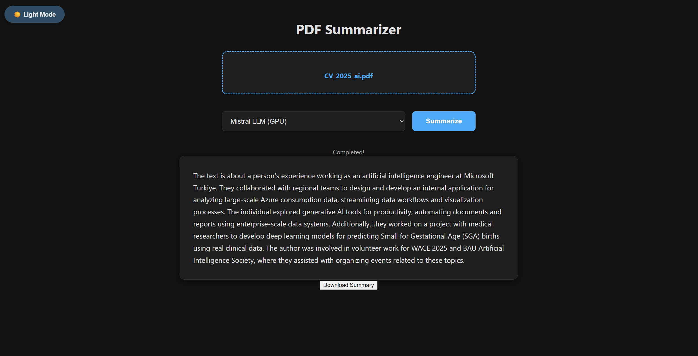

# PDF Summarizer with Local LLMs & Streaming

A full-stack application that ingests PDF documents, splits them into manageable chunks, and uses various LLM strategies (Map-Reduce) to generate concise summaries. Features real-time streaming progress updates.




## 🚀 Features
* **Multi-Model Support:**
    * **T5-Small:** Fast, local CPU inference.
    * **BART-Large:** High-quality abstractive summarization.
    * **Mistral 7B (GGUF):** Quantized local LLM for instruction-following capabilities.
    * **Gemini API:** Cloud-based processing for large context.
* **Smart Chunking:** Uses overlap and dynamic token estimation to prevent context-window crashes.
* **Real-Time Feedback:** Server-Sent Events (SSE) stream progress bars and time estimates to the frontend.
* **Map-Reduce Pipeline:** Summarizes chunks individually ("Map") then synthesizes them into a final report ("Reduce").

## 🛠️ Tech Stack
* **Frontend:** Vanilla JavaScript (ES6 Modules), HTML5, CSS3.
* **Backend:** FastAPI (Python), Uvicorn.
* **AI/ML:** PyTorch, Transformers (Hugging Face), ctransformers (for GGUF), Google Generative AI.
* **PDF Engine:** PyMuPDF (fitz).

## 📋 Prerequisites
* **Python:**  3.12.9
* **Node.js:** (Optional, only if you add a build step later)
* **Hardware:**
    * Minimum 8GB RAM (for T5/BART).
    * Recommended 16GB+ RAM & NVIDIA GPU (for Mistral).

## ⚙️ Installation

1.  **Clone the repository**
    ```bash
    git clone [https://github.com/Stywestern/pdf-summarizer.git](https://github.com/Stywestern/pdf-summarizer.git)
    cd pdf-summarizer
    ```

2.  **Backend Setup**
    ```bash
    # Create virtual environment
    python -m venv venv
    source venv/bin/activate  # Windows: venv\Scripts\activate

    # Install dependencies
    pip install -r requirements.txt
    ```

3.  **Environment Variables**
    Create a `.env` file in the root directory:
    ```ini
    GOOGLE_NLP_API_KEY=your_key_here
    # Optional: Set default device (cpu or cuda)
    DEVICE=cuda
    ```

4.  **Download Mistral Model (If using local LLM)**
    Download `mistral-7b-v0.1.Q4_K_M.gguf` and place it in the root folder.
    * [*Link to HuggingFace model download...*](https://huggingface.co/TheBloke/Mistral-7B-v0.1-GGUF)

## ▶️ Usage

1.  **Start the Backend**
    ```bash
    uvicorn main:app --reload
    ```
    The API will run at `http://127.0.0.1:8000`.

2.  **Start the Frontend**
    Since this is vanilla JS, you can serve it with any static server.
    ```bash
    # Python simple server
    python -m http.server 3000
    ```
    Open `http://localhost:3000` in your browser.
